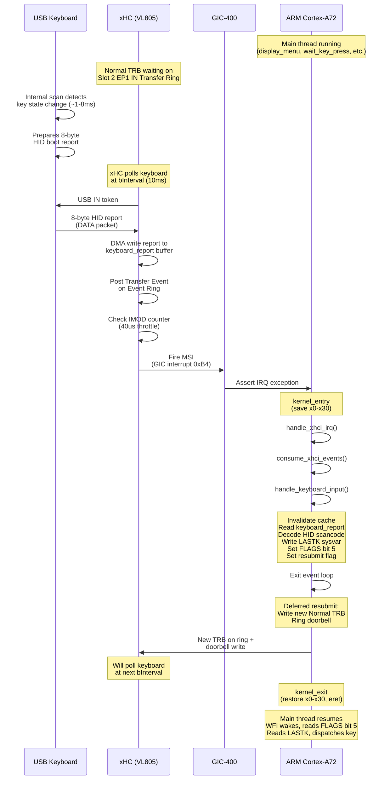
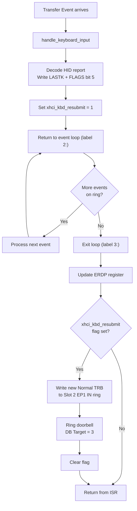
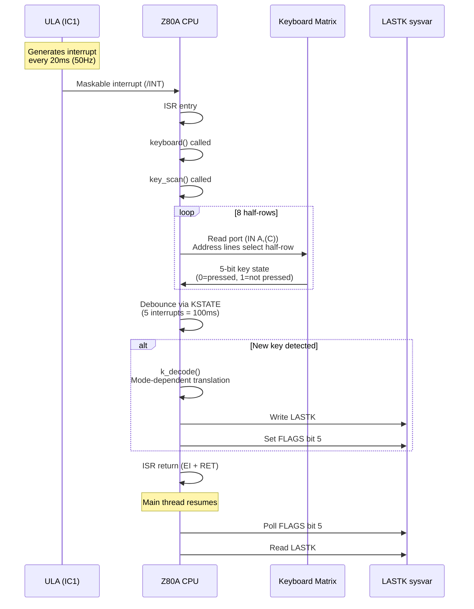

# Keyboard Interrupt Pipeline: Spectrum 128K vs RPi 400

This document describes how keyboard input flows from physical keypress to
application code on both the original ZX Spectrum 128K and the Spectrum +4
project running on Raspberry Pi 400.

## RPi 400 / xHCI Pipeline

The RPi 400 uses USB HID over xHCI, with MSI (Message Signaled Interrupts)
to notify the CPU. The pipeline involves four independent hardware components
each running on their own clock.



### Timing Bounds

```mermaid
gantt
    title Keypress-to-LASTK Latency Breakdown
    dateFormat X
    axisFormat %L ms

    section Best Case (~1ms)
    Keyboard internal scan     :a1, 0, 1
    xHC poll (immediate)       :a2, after a1, 0
    IMOD throttle              :a3, after a2, 0
    ISR execution              :a4, after a3, 0

    section Worst Case (~18ms)
    Keyboard internal scan     :b1, 0, 8
    Wait for next bInterval    :b2, after b1, 10
    IMOD throttle (40us)       :b3, after b2, 0
    ISR execution              :b4, after b3, 0
```



| Stage | Best case | Worst case | Notes |
|-------|-----------|------------|-------|
| Key press to HID report ready | ~1ms | ~8ms | Keyboard's internal scan rate (LS: 1-8ms) |
| HID report ready to xHC reads it | 0ms | 10ms | xHC polls at bInterval=10ms |
| xHC reads report to MSI fires | 0us | 40us | IMOD throttle (IMODI=160, 160x250ns=40us) |
| MSI to ISR starts | <1us | <1us | GIC latency + exception entry |
| ISR execution | ~1-2us | ~5us | Event loop + decode + LASTK write + resubmit |
| **Total: key press to LASTK written** | **~1ms** | **~18ms** | |
| LASTK to main thread reads it | 0us | ~10ms | WFI wake is immediate if already sleeping |

### Deferred Resubmit

The keyboard interrupt resubmit is deferred to after the event loop exits.
This prevents the event loop from becoming a tight loop if the xHC completes
a new TRB before the event loop finishes iterating.



### Idle Behaviour

The keyboard always responds to USB IN tokens with an 8-byte HID report,
even when no keys are pressed (report = `00 00 00 00 00 00 00 00`). Since
we always resubmit a TRB after each Transfer Event, the system generates
a continuous stream of interrupts at ~10ms intervals:

```
xHC polls → keyboard sends zeros → Transfer Event → MSI →
ISR runs → scancode=0, skip LASTK write → resubmit TRB →
return → WFI → 10ms later → repeat
```

Each idle wakeup costs ~1-2us of CPU time. The CPU spends >99.99% of
idle time in WFI (low-power wait state).

### Key Components

| Component | Role | Clock/Rate |
|-----------|------|------------|
| USB Keyboard | Scans key matrix, sends HID reports | Internal ~1-8ms scan rate |
| VL805 xHC | USB host controller, manages transfers | bInterval=10ms poll rate |
| BCM2711 PCIe RC | Routes MSI from VL805 to GIC | Hardware, <1us |
| GIC-400 | Interrupt controller, routes IRQ to CPU | Hardware, <1us |
| Cortex-A72 CPU | Runs ISR + main thread | 1.8GHz (arm_boost=1) |

### Relevant Registers

| Register | Address | Value | Purpose |
|----------|---------|-------|---------|
| IMOD | Runtime + 0x224 | 0x00A0 | Interrupt moderation: IMODI=160 (40us) |
| ERDP | Runtime + 0x238 | varies | Event Ring Dequeue Pointer |
| Doorbell[2] | Doorbell + 0x08 | 0x03 | Ring doorbell for Slot 2 EP1 IN |
| GICC_IAR | 0xFF84200C | 0xB4 | GIC interrupt acknowledge (PCIe MSI) |
| LASTK | sysvars + offset | 0x00-0xFF | Last decoded key code |
| FLAGS | sysvars + offset | bit 5 | New key available signal |

---

## ZX Spectrum 128K Pipeline

The Spectrum uses a direct-wired keyboard matrix scanned by the CPU at
50Hz, driven by the ULA's maskable interrupt.



### Timing

| Stage | Time | Notes |
|-------|------|-------|
| ULA interrupt period | 20ms (fixed) | 50Hz, driven by TV frame rate |
| Keyboard matrix scan (all 8 rows) | ~100us | 8 port reads + bit manipulation |
| Debounce minimum | 100ms | Key must be held for 5 consecutive scans |
| First repeat delay (REPDEL) | 700ms | Default: 35 interrupts |
| Subsequent repeat rate (REPPER) | 100ms | Default: 5 interrupts |
| **Worst-case first keypress latency** | **120ms** | 20ms scan + 100ms debounce |

---

## Comparison

| | Spectrum 128K | RPi 400 (Spectrum +4) |
|---|---|---|
| **Scan method** | Direct port read (wired matrix) | USB polling via xHC |
| **Scan rate** | Fixed 50Hz (20ms) | bInterval=10ms, event-driven |
| **Worst-case latency (key to code)** | 20ms scan + 100ms debounce = 120ms | ~18ms (no debounce, keyboard handles it) |
| **Best-case latency** | 0ms scan + 100ms debounce = 100ms | ~1ms |
| **Debounce** | Software: 5 scans = 100ms mandatory | Hardware: done by keyboard controller |
| **Key repeat** | REPDEL (700ms) then REPPER (100ms) | Not yet implemented |
| **Buffering** | None: LASTK holds 1 key | None: LASTK holds 1 key |
| **Lost keypresses** | Yes, if main thread too slow | Yes, same design |
| **CPU cost when idle** | ~0.5% (scan runs every 20ms) | ~0.001% (WFI sleeps, wakes every 10ms for ~2us) |
| **Hardware components** | 2 (ULA + Z80) | 5 (keyboard + xHC + PCIe RC + GIC + CPU) |
| **Interrupt source** | ULA frame counter | xHC MSI via GIC |
| **Simultaneous keys** | 2 (KSTATE buffers) | 6 (HID boot report bytes 2-7) |

---

## Source References

- `src/spectrum4/kernel/xhci.s` — handle_keyboard_input, consume_xhci_events, deferred resubmit
- `src/spectrum4/kernel/irq.s` — GIC setup, handle_xhci_irq, handle_irq_bcm2711
- `src/spectrum4/kernel/pcie.s` — MSI setup, IMOD configuration, xhci_vars structure
- `src/spectrum4/kernel/entry.s` — kernel_entry/kernel_exit macros, vector table
- `src/spectrum4/roms/wait_key_press.s` — FLAGS bit 5 WFI polling loop
- `src/spectrum4/roms/process_key.s` — key dispatch
- `src/spectrum128k/roms/rom1.s:1143` — key_scan (Z80 keyboard scanning)
- `src/spectrum128k/roms/rom1.s:1214` — keyboard (debounce + decode)
- ZX Spectrum 128 Service Manual, Section 1.5.2 — Keyboard Scanning
